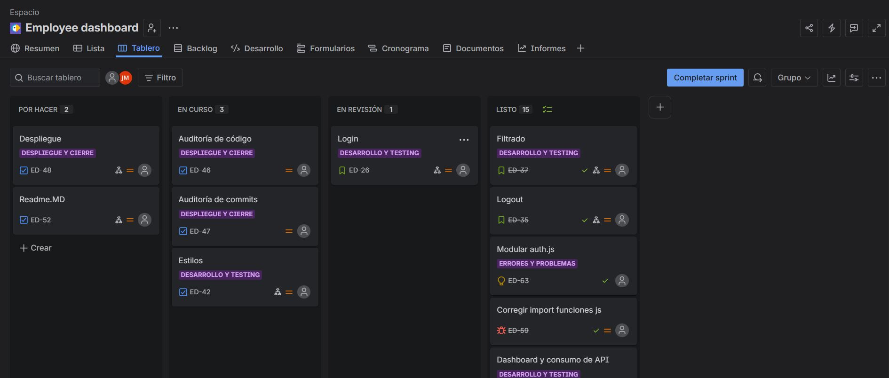
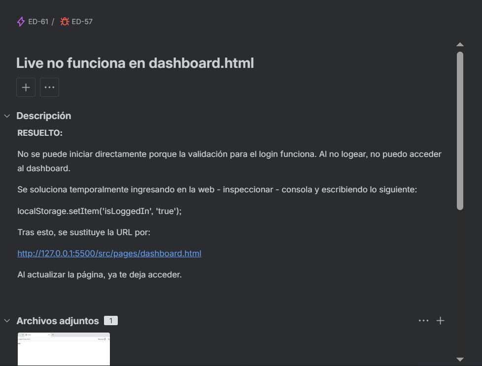
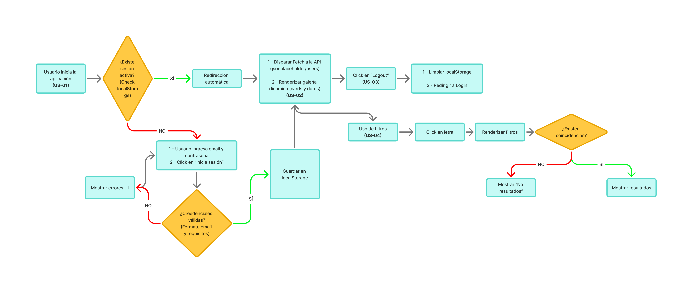
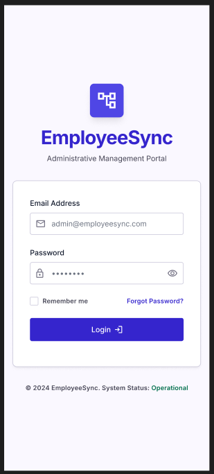
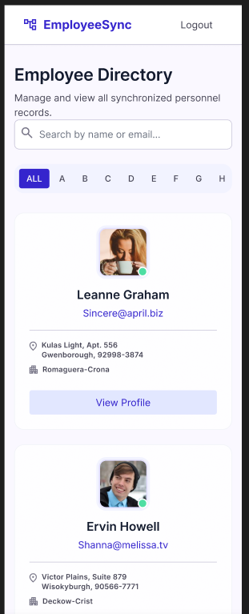
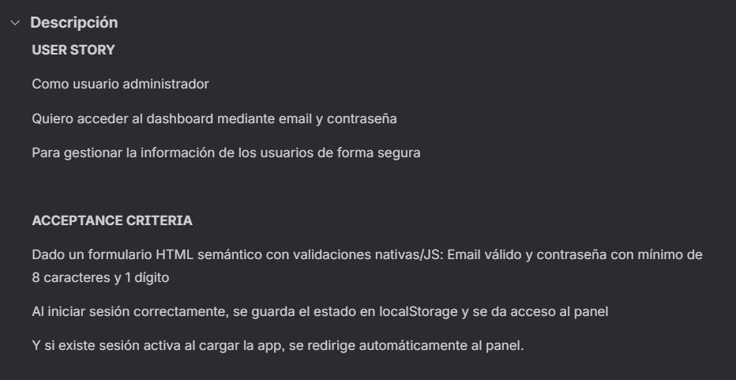
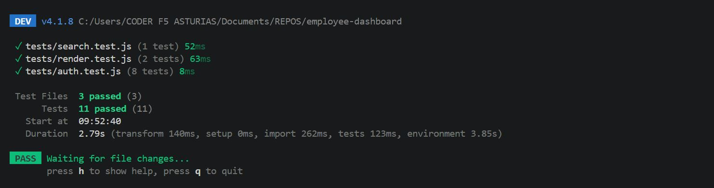
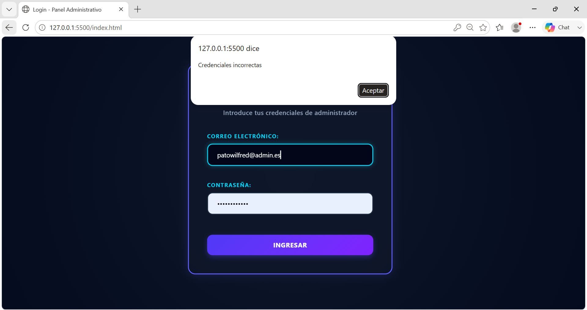
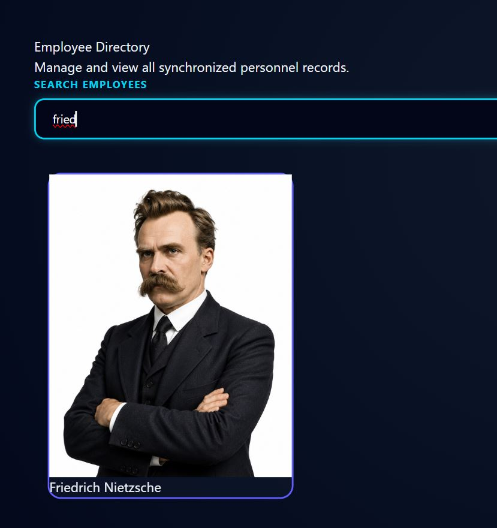

# Panel de empleados (Employees Dashboard)

---

## Descripción del proyecto

El objetivo del proyecto es desarrollar una aplicación web **dinámica** de tipo dashboard administrativo para la gestión de la plantilla de empleados.

La aplicación que se presenta permite el acceso mediante **login seguro** siendo precisa para el ingreso un usuario y contraseña autorizados, presentando ambas credenciales **requerimientos de formato**. Así mismo, muestra el **listado de empleados** que constituye la plantilla, así como su búsqueda mediante **filtro por letras del nombre**. Por último, se puede cerrar la sesión vía **logout**. La permanencia o no de la sesión se gestiona con **localStorage***.

---

## Tecnologías utilizadas

He desarrollado la aplicación con **HTML5 semántico**, **CSS Tailwind y nesting**, **JavaScript vanilla ES6** y tests unitarios con **Vitest**. La gestión y seguimiento del proyecto se ha realizado con **Jira**. El prototipado fue diseñado con **Google Stitch** y el Userflow con **Figma**.

---

## Planificación y seguimiento con Jira

Se utiliza la plataforma Jira para la gestión y el seguimiento del proyecto con metología **Scrum** durante el transcurso de una semana; margen estipulado para el sprint.

**Tablero Jira**

**Bugs en Jira**

En este proyecto se hace uso del registro de bugs y problemas varios que aparecen durante el desarrollo. Se registra el caso según se detecta el error y se actualiza con la resolución del mismo.

**Peticiones stakeholder**

Las peticiones del stakeholder también quedan registradas en una categoría propia.

---

## Userflow

El diseño del userflow se realiza con FigJam en la plataforma Figma.

---

## Prototipo 

El prototipado se realiza con Google Stitch. Marca el esbozo de la interfaz, aunque es susceptible a modificaciones durante el sprint. 

**Login**

**Dashboard**

---

## Historias de usuario

Se hace uso de historias de usuario (user stories) y de criterios de aceptación (acceptance criteria). También se registra en Jira.

---

## Testeo

Realizamos testeo de los archivos Javascript con **Vitest**.

## Resultados obtenidos

Se cumplen con todos los requisitos funcionales requeridos, tal y como mostramos a continuación:

**Login seguro**

Para acceder al dashbboard el usuario debe iniciar sesión con las credenciales adecuadas. Si se ingresa un usuario no registrado, saltará un error.

**Interfaz del dashboard**

Una vez accedido, se despliega la interfaz del dashboard que recoge el renderizado del array.js que contiene la plantilla de empleados.

**Búsqueda por filtro**

El filtro realiza un cribado según el nombre del empleado. Aquellos que no coinciden con la búsqueda desparecen de la interfaz. Si la búsqueda se limpia, reaparecen. Esto ocurre en tiempo real.

**Logout**

El logout funciona y permite al usuario cerrar sesión. Será necesario introducir nuevamente credenciales válidas para acceder al bashboard. 

## Modificaciones

Se realizan algunos ajustes durante el desarrollo, pero el más relevante es el método de búsqueda. En origen se solicita un buscador por letra, es decir, se debía crear una botonera con todas las letras del abecedario. Esto daba como resultado una interfaz engorrosa y poco intuitiva, por lo que se susttuye por la búsqueda en tiempo real con escritura.

## Mejoras pendientes

Una vez presentado el proyecto, se marcan como pendientes dos mejoras para una próxima versión, a saber:

BACKEND - REFACTORIZACIÓN: Se han realizado refactorizaciones, pero no todas las pretendidas. El objetivo es cumplir con el principio de DRY (dont repeat yourself).

FRONTEND - TAILWIND: Se busca un estilo más pulido que el actual, que se encuentra en una fase primaria, si bien no incumple el PMV (Producto Mínimo Viable) y se ha relegado a segundo plano por priorización y cumplimiento de plazos.

